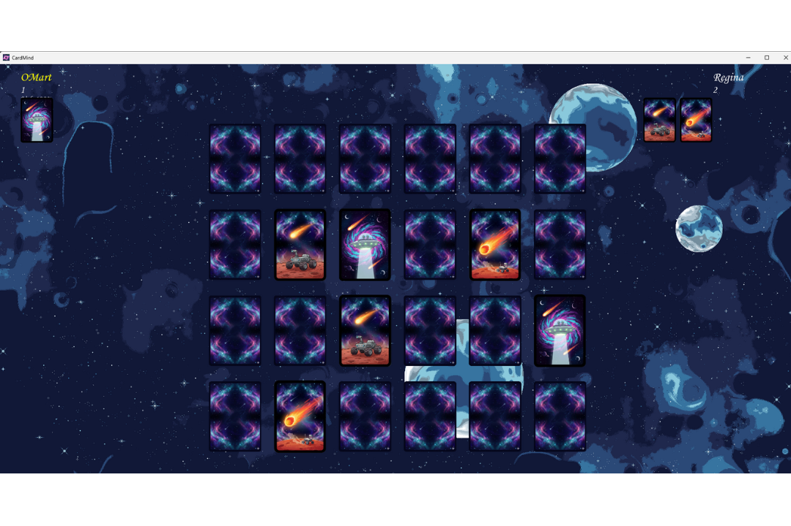

# 🎴 CardMind 


Un emocionante juego de memoria desarrollado en C++ con SFML. Desafía tu mente en modos Solitario (12 cartas) o 1 vs 1 (24 cartas), con música inmersiva, efectos de sonido y control de volumen.

## ✨ Características

- 🎮 **Dos modos de juego**: Solitario para práctica individual y 1 vs 1 para competir con amigos.
- 🎵 **Audio completo**: Música de fondo y efectos sonoros para una experiencia envolvente.
- 🔊 **Control de volumen**: Ajusta el sonido fácilmente con las flechas del teclado.
- 🖥️ **Interfaz intuitiva**: Navegación por menú con ratón y entrada de nombres de jugadores.
- 📱 **Layout adaptable**: Cartas que se escalan dinámicamente para resolución 1920x1080.

## 📸 Capturas de Pantalla

### Pantalla Principal


### Modo 1 vs 1


### Pantalla de Victoria


## 📋 Requisitos

- **Sistema operativo**: Windows o Linux.
- **Herramientas**: `make` y g++ con soporte para C++17.
- **Dependencias**:
  - SFML (graphics, window, system, audio).
  - Box2D (opcional, según configuración del Makefile).

## 🚀 Instalación y Ejecución

1. Clona el repositorio:
   ```bash
   git clone https://github.com/RickXD888/Cadmind_3-G_252.git
   cd Cadmind_3-G_252
   ```

2. Compila el proyecto:
   ```bash
   make
   ```

3. Ejecuta el juego:
   ```bash
   make run
   ```

Para un rebuild completo:
```bash
make actualizar-force
```

## 📁 Estructura del Proyecto

```
Cadmind_3-G_252/
├── .github/
│   └── workflows/
│       └── publish.yml          # Workflow de GitHub Actions
├── .vscode/
│   ├── c_cpp_properties.json    # Configuración de C/C++ para VS Code
│   └── settings.json            # Configuraciones de VS Code
├── assets/                      # Recursos multimedia
│   ├── imagenes/                # Imágenes y capturas
│   │   ├── backgrounds/         # Fondos de pantalla
│   │   ├── cards/               # Texturas de cartas
│   │   │   ├── baraja-1/        # Primera baraja
│   │   │   └── baraja - 2/      # Segunda baraja
│   │   ├── menu/                # Imágenes del menú
│   │   └── trofeo.png           # Imagen del trofeo
│   ├── music/                   # Música y efectos de sonido
│   └── tipografia/              # Fuentes tipográficas
├── bin/                         # Ejecutables compilados
├── gallery/                     # Galería de imágenes adicionales
├── include/                     # Headers auxiliares
│   ├── Juego.hpp                # Header para Juego
│   └── Menu.hpp                 # Header para Menu
├── screenshots/                 # Capturas de pantalla
├── src/                         # Código fuente C++
│   ├── Juego.cpp                # Lógica del juego
│   ├── main.cpp                 # Bucle principal
│   └── Menu.cpp                 # Pantalla de menú
├── video/                       # Videos del proyecto
├── LICENSE                      # Archivo de licencia
├── README.md                    # Este archivo
└── makefile                     # Script de compilación
```

## 🎯 Controles y Cómo Jugar

### Menú Principal
- Usa el **ratón** para seleccionar "JUGAR".
- Elige entre **SOLITARIO** o **1 VS 1**.
- En modo 1 vs 1, haz clic en los campos para ingresar nombres de jugadores y presiona "COMENZAR".

### Durante el Juego
- **Clic izquierdo** en las cartas para voltearlas y emparejarlas.
- En 1 vs 1, si fallas, pasa el turno al oponente.
- **Flechas arriba/abajo** para ajustar el volumen.
- **Esc** para salir al menú.

### Objetivo
- Encuentra todos los pares de cartas lo más rápido posible.
- En 1 vs 1, gana quien tenga más pares al final.

## 🔧 Notas de Implementación

- **UI**: Utiliza SFML para textos (`sf::Text`), sprites (`sf::Sprite`) y audio (`sf::Music`, `sf::Sound`).
- **Layout dinámico**: Las cartas se ajustan automáticamente según el número de filas/columnas (3x4 para 12 cartas, 4x6 para 24).
- **Modo 1 vs 1**: Gestiona puntajes (`score[2]`), miniaturas de pares emparejados y turnos (`currentPlayer`).
- **Volumen sincronizado**: `Menu::getVolume()` y `Juego::setMasterVolume()` mantienen consistencia.

## 🚀 Mejoras Futuras

- Mejorar la edición de texto (selección, pegar, cursor más robusto).
- Agregar transiciones suaves y animaciones al hacer hover.
- Implementar guardado de resultados y estadísticas en archivo.

## 📄 Licencia

Este proyecto está bajo la licencia MIT. Consulta el archivo [LICENSE](LICENSE) para más detalles.

**Autores**: Ricardo OCiel Guzmán Delgado y Jersson Almir Gonzalez Gomez  
© 2025

